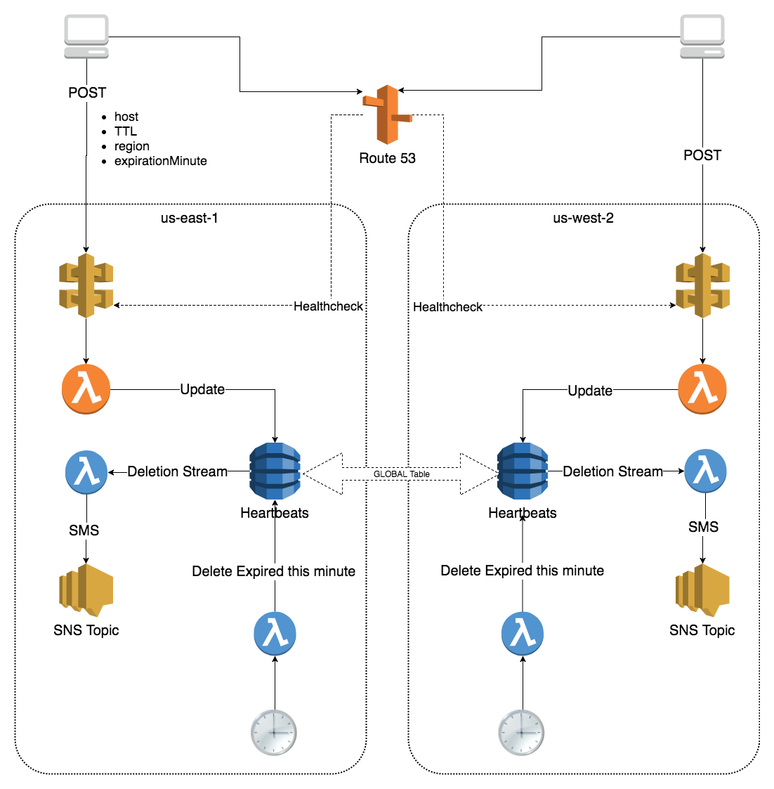

# Code Architecture

  

## `handlers` package  
The actual implementation of the functions should be placed in `com.tddapps.handlers`. These classes have some knowledge of the serverless framework. If testing becomes too cumbersome extract services.  

In general these classes should throw no exceptions. They should handle them gracefully and log them accordingly as `warn` or `error`.  

## `model` package  

Where most of the code and business logic will live. This package should be independent of implementation details.  

## `utils` package  

Reusable helpers that are not specific to the project. This could potentially live in a separate repository altogether.  

## `internal` packages  

Contain concrete implementations. Should not be directly referenced.  
These packages are a way to circumvent the disadvantage of having to mark every class as `public`.  
Ideally, interface implementations should be package-private. But this would required many factory classes.  

## `model.internal.aws` package  

The concrete implementation of many of the interfaces. These classes can only be tested with integration tests. When the day comes the cloud provider needs to be replaced, only the equivalent for these classes should need to be implemented.    

## Logging  

Try to keep logging meaningful. Use `info` for events that enhance the operations.  
Avoid logging exceptions as `warn` or `error` unless in handlers.  
